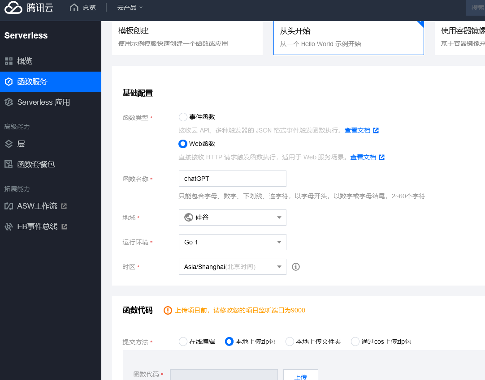
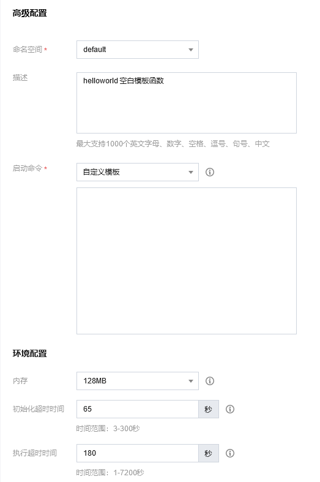
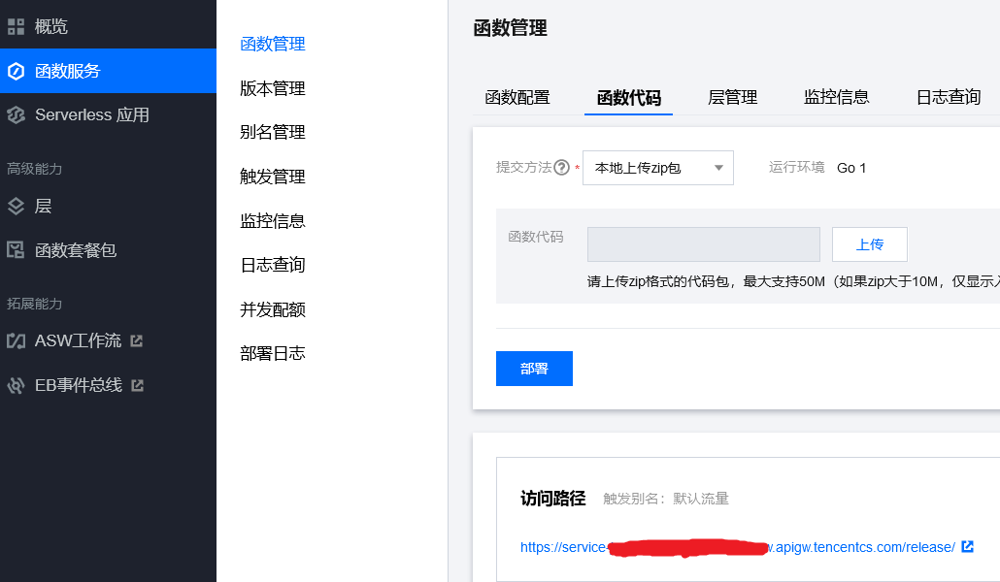

# ChatGPT Reverse Proxy

ChatGPT\_reverse\_proxy is an AI API reverse proxy. It can be used on self-built servers or cloud functions.

- It supports reverse proxy for OpenAI API by default. When making API requests, simply replace the interface address (<https://api.openai.com>) with the address of the reverse proxy service.
- It supports reverse proxy for Azure OpenAI API. Set the OXY\_TARGET environment variable to the Azure OpenAI service address (e.g., <https://docs-test-001.openai.azure.com>).

## Available Environment Variables

1. OXY\_TARGET: Reverse proxy target, default=<https://api.openai.com>
2. OXY\_PORT: Proxy service port, default=9000
3. OXY\_HOP\_HEADER\_PREFIX: Skip http header prefix, default is empty

## Self-hosted chatGPT Reverse Proxy Service

### Using Binary Release

1. Supported operating systems
	* Windows
	* Linux
	* macOS
	* FreeBSD
	* OpenBSD
2. Download the `chatgpt_reverse_proxy` [latest version releases](https://github.com/lenye/chatgpt_reverse_proxy/releases)
3. Run it:

```shell
# If you need to redefine environment variables
$ export OXY_PORT=9000

$ ./chatgpt_reverse_proxy
```

### Docker

1. Pull container image

```shell
$ docker pull ghcr.io/lenye/chatgpt_reverse_proxy
```

2. docker-compose

```yaml
services:
   chatgpt_reverse_proxy:
      image: ghcr.io/lenye/chatgpt_reverse_proxy:latest
      restart: unless-stopped
      ports:
         - "9000:9000"
      volumes:
         - /etc/localtime:/etc/localtime:ro
         - /etc/timezone:/etc/timezone:ro
      environment:
         OXY_PORT: "9000"
         OXY_TARGET: "https://api.openai.com"
         OXY_HOP_HEADER_PREFIX: ""
```

### Building a chatGPT Reverse Proxy Service on Cloud Functions

<details>
<summary>Tencent Cloud Function</summary>

Use Tencent Cloud Function to build a chatGPT reverse proxy service.

#### Predefined Environment Variables

1. OXY\_PORT: 9000 (proxy service port)
2. OXY\_HOP\_HEADER\_PREFIX: X-SCF (skip http header prefix)

#### ZIP Package Download

- Download link: <https://github.com/lenye/chatgpt_reverse_proxy/releases>
- File name: tencentcloud\_scf\_chatgpt\_reverse\_proxy\_v0.x.x\_linux\_amd64.zip

#### A. Create a Cloud Function

1. Enter the Tencent Cloud Function Console: <https://console.cloud.tencent.com/scf/list?rid=15&ns=default>
2. "Cloud Products" --> "Serverless" --> "Cloud Function"
3. "Function Service" --> "New"
   - Click "Start from Scratch"
   - Basic Configuration
      - Function Type: Web Function
      - Name: Fill in; e.g., chatGPT
      - Region: Select an overseas region, such as the US
      - Runtime Environment: Go 1
      - Time Zone: Asia/Shanghai(Beijing Time)
   - Function Code
      - Submission Method: Upload a package locally
   - Advanced Configuration
      - Start Command: Custom Template
   - Environment Configuration
      - Memory: 128MB
      - Execution Timeout: 180 seconds
   - Click "Complete"





#### B. Function Management

1. Enter the Tencent Cloud Function Console: <https://console.cloud.tencent.com/scf/list?rid=15&ns=default>
2. "Function Service" --> Select the newly created function "chatGPT" from the function list
3. "Function Management" --> "Function Code"
   - Access Path

```bash
Copy link: https://service-xxx-xxx.xxx.apigw.tencentcs.com/release/
```



#### C. chatGPT Reverse Proxy Service - Tencent Cloud Function Address

Remove "/release/" from the Access Path to obtain the chatGPT reverse proxy service - Tencent Cloud Function address:

<https://service-xxx-xxx.xxx.apigw.tencentcs.com>

Replace the interface address (<https://api.openai.com>) with the Tencent Cloud Function address when making chatGPT API requests.

#### D. OpenAI API Endpoint Examples:

```
https://service-xxx-xxx.xxx.apigw.tencentcs.com/v1/completions
https://service-xxx-xxx.xxx.apigw.tencentcs.com/v1/chat/completions
```

</details>

<details>
<summary>Aliyun Function Compute</summary>

#### Predefined Environment Variables

1. OXY\_PORT: 9000 (proxy service port)
2. OXY\_HOP\_HEADER\_PREFIX: X-FC (skip http header prefix)

#### ZIP Package Download

- Download link: <https://github.com/lenye/chatgpt_reverse_proxy/releases>
- File name: aliyun\_fc\_chatgpt\_reverse\_proxy\_v0.x.x\_linux\_amd64.zip

#### Create a Function

1. Function Comput

</details>

## Usage Examples

### OpenAI

```go
package main

import (
	"context"
	"fmt"
	"os"

	"github.com/sashabaranov/go-openai"
)

func main() {
	cfg := openai.DefaultConfig(os.Getenv("OPENAI_API_KEY"))

	// Modify BaseURL to the reverse proxy service address, e.g., Tencent Cloud Function address, with "/v1"
	cfg.BaseURL = "https://service-xxx-xxx.xxx.apigw.tencentcs.com/v1"

	client := openai.NewClientWithConfig(cfg)

	ctx := context.Background()
	// list models
	models, err := client.ListModels(ctx)
	if err != nil {
		fmt.Printf("ListModels error: %v\n", err)
		os.Exit(1)
	}
	// print the first model's id
	fmt.Println(models.Models[0].ID)
}

```

#### Other Examples

<details>
<summary>Python</summary>

```python
import os

import openai

openai.api_key = os.getenv("OPENAI_API_KEY")

# Modify api_base to the reverse proxy service address, e.g., Tencent Cloud Function address, with "/v1"
openai.api_base = "https://service-xxx-xxx.xxx.apigw.tencentcs.com/v1"

# list models
models = openai.Model.list()
# print the first model's id
print(models.data[0].id)
```

</details>
